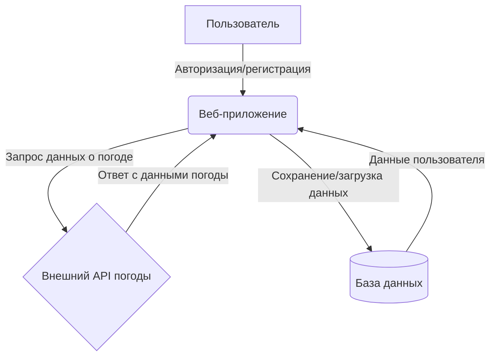
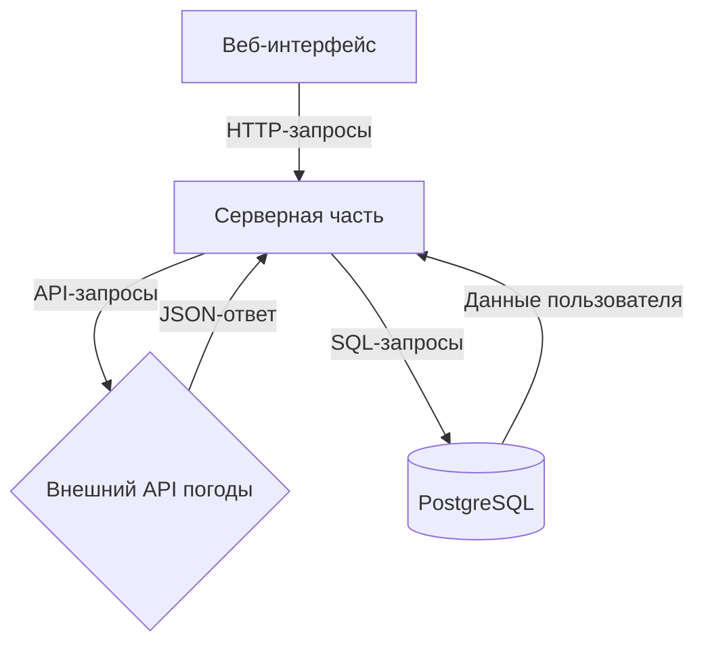

# Описание проекта
Веб-приложение для прогноза погоды
## Участники проекта

- Гончаров Родион Романович 5130904/20101

- Загидулин Ранис Радикович 5130904/20101

- Костюченко Тимофей Романович 5130904/20101

[Ссылка на репозиторий](https://github.com/raniszagid/weather_app)

# Этапы разработки:
## 1. Определение проблемы

Пользователи часто сталкиваются с необходимостью проверять прогноз погоды для разных городов, но существующие сервисы не всегда предоставляют удобный интерфейс для сохранения истории запросов и персонализации данных. Это приводит к повторному вводу одних и тех же городов и отсутствию возможности отслеживать изменения погоды для избранных мест.

## 2. Выработка требований

Пользовательские сценарии:
    Регистрация и авторизация:
        Пользователь регистрируется в системе, указывая login и пароль.
	    После авторизации пользователь получает доступ к персонализированным 
	    функциям.

    Поиск прогноза погоды:
        Пользователь вводит название города и получает актуальный прогноз погоды 
        (температура, скорость ветра, описание погоды).

    Сохранение истории запросов:
        Пользователь может просматривать историю своих запросов, чтобы быстро 
        получить информацию по ранее интересовавшим городам.

Оценка числа пользователей:
    Ожидаемое количество пользователей: 10 000 в сутки.
    Период хранения информации: 5 лет.

## 3. Разработка архитектуры и детальное проектирование

### Характер нагрузки на сервис:
Соотношение R/W нагрузки: 70% чтения (запросы погоды), 30% записи (регистрация, история запросов).
Объемы трафика: ~1 000 000 запросов в месяц.
Объемы дисковой системы: ~50 ГБ для хранения истории запросов и данных пользователей.

### Диаграммы C4 Model:

#### Контекстная диаграмма:
Взаимодействие пользователя с веб-приложением, внешним API погоды и базой данных.

#### Диаграмма контейнеров:
Веб-интерфейс, серверная часть, база данных PostgreSQL, внешний API погоды.

### Контракты API:
/api/weather?city={name} — возвращает прогноз погоды для указанного города.
/api/history — возвращает историю запросов пользователя.

### Нефункциональные требования:
Время отклика API: < 500 мс.
Доступность сервиса: 99.9%.

### Схема базы данных и обоснование

#### Описание таблиц:
users
	Содержит данные пользователей:
	    id — уникальный идентификатор (первичный ключ).
        username — уникальное имя пользователя.
        password — хэшированный пароль.

request
	Хранит историю запросов пользователей:
		id — уникальный идентификатор запроса.
		address — название города или адрес, для которого запрашивалась погода.
		request_timestamp — время выполнения запроса.
		user_id — внешний ключ, связывающий запрос с пользователем (users.id).

weather
	Содержит данные о текущей погоде:
		id — уникальный идентификатор.
		temperature — температура.
		wind — скорость ветра.
		description — текстовое описание погоды (например, "ясно", "дождь").
		request_id — внешний ключ, связывающий погоду с запросом (request.id).

days
	Хранит прогноз погоды на несколько дней:
		id — уникальный идентификатор.
		date — дата прогноза (в числовом формате, например, YYYYMMDD).
		temperature — прогнозируемая температура.
		wind — прогнозируемая скорость ветра.
		weather_id — внешний ключ, связывающий прогноз с текущей погодой (weather.id).

#### Обоснование выбранной схемы:

Нормализация:
	Данные разделены на логические таблицы для избежания дублирования (например, прогноз на дни вынесен в отдельную таблицу).
	Связи через внешние ключи (on delete cascade) обеспечивают целостность данных при удалении записей.

Производительность:
	Индексы на первичные ключи (id) ускоряют поиск.

Масштабируемость:
    При росте нагрузки (>10k пользователей):
        Репликация базы данных (PostgreSQL) для распределения запросов на чтение.
        Шардинг таблицы request по user_id для равномерного распределения нагрузки.
	
Схема масштабирования:
    Горизонтальное масштабирование серверной части с использованием балансировщика нагрузки.
    Репликация базы данных для распределения нагрузки.

## 4. Кодирование и отладка
- Реализована регистрация и авторизация пользователей.
- Интеграция с внешним API погоды (weather-api).
- Сохранение и отображение истории запросов.
- Каждый участник команды внес коммиты в репозиторий.

## 5. Unit тестирование
- Написаны тесты для проверки корректности работы API.
- Пример теста: проверка обработки запроса погоды для несуществующего города.

## 6. Интеграционное тестирование
Реализован сценарий:
	Пользователь авторизуется.
	Запрашивает погоду для города "Москва".
	Проверяет, что запрос сохранен.

## 7. Сборка

### Инструкция для запуска:
Сборка проекта:
	Выполните команду:
		docker-compose build

		Эта команда соберет все необходимые образы для приложения, базы данных 
		и других сервисов.

Запуск Unit тестов:
	Для запуска unit-тестов выполните:
		docker-compose run --rm app pytest tests/unit -v

		Где app — название сервиса в docker-compose.yml, а tests/unit — путь к unit
		-тестам.
		

Запуск интеграционных тестов:
	Для запуска интеграционных тестов выполните:
		docker-compose run --rm app pytest tests/integration -v
		
	Интеграционные тесты проверяют взаимодействие компонентов (например, API и 
	базы данных).

Запуск приложения:
	Для запуска приложения выполните:
		docker-compose up

	Приложение будет доступно по адресу http://localhost:8080 (порт может 
	отличаться в зависимости от конфигурации).
